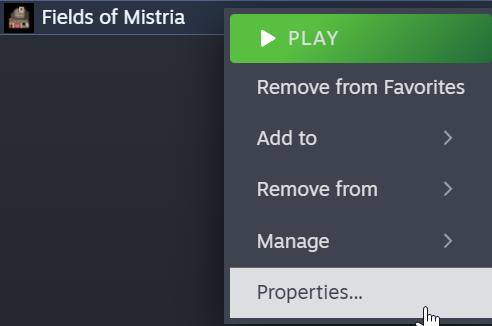

# Logs

*Fields of Mistria* has robust logging. For users who, for any reason, want to view their logs, they can write their logs to a file using Steam's command-line options interface.

To do that, nagivate to *Fields of Mistria*'s properties page by right-clicking the game in your Steam library, like so:



Then input the following into the "Launch Options" sections:

```sh
-output "C:\path\to\a\folder\log.txt"
```

Afterwards, while the game is running, a log will be written to `log.txt`. However, this **may have a minor performance impact, particularly on a slow hard-drive**, so consider doing this only occasionally if any frame issues arise.

For me, my output looked like the following:


For more information, see [setting launch options on Steam](https://help.steampowered.com/en/faqs/view/7D01-D2DD-D75E-2955) and [GameMaker's Command-Line options](https://manual.gamemaker.io/monthly/en/Settings/Command_Line_Parameters.htm).
