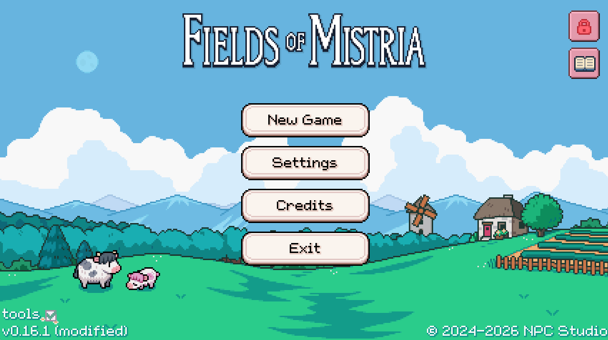
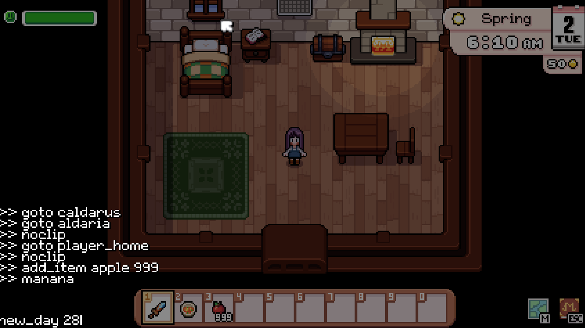

# Accessing BUGGER
`BUGGER` is an in-game terminal for in-game manipulation of Fields of Mistria. It is considered a `debug-tool` so you can only access `BUGGER` if you pass in `--debug-tools=true` to the [CLI on startup](./cli.md).

All of the commands available in `BUGGER` are **not** stable and **many** will cause instabilities in your game. The most stable thing to do is to **not use `BUGGER`**. We have no stability promises with `BUGGER` and it undergoes zero testing beyond our own use as developers.

With all those warnings out of the way...

## Activating `BUGGER`
`BUGGER` is considered a `debug-tool` so you can only access `BUGGER` if you pass in `--debug-tools=true` to the [CLI on startup](./cli.md).

Once that is done, you should see see the following in the Title Screen:

Notice that the markers in the top-right for "All Unlocks" and "Story Mode" will also appear.

Then, in-game, press `F2` to open `BUGGER`:

Press `F2` to close it again. In the example above, you can also see the results of previous commands.

To find the available list of commands, look in `assets/gml/scripts/Debug/BuggerInitialize.gml` or type `help` in `BUGGER` itself.

Here are a few common commands:

### `goto <LOCATION_ID | NPC_ID>`
Use this command to go to any location in the game except the Mines.

To go to the town instantly, type `goto town` and hit enter.
To go to `adeline` instantly, type `goto adeline` and hit enter.

### `noclip`
Very often when using `goto`, the player will end up inside some collision and cannot move out of it.

Type `noclip` and hit enter to begin ignoring collisions.
While `noclip` is active, run the command again (type `noclip` in `BUGGER` and hit enter) to stop `noclip`.

Note that `noclip` and swimming produce strange interactions.

### `add_item <ITEM_ID>`
You can add any item to the Player's inventory by running the command `add_item`.

For example, to add an Apple, run `add_item apple`. To add 999 apples to your inventory, type `add_item apple 999`.

### `new_day <NUMBER_OF_DAYS>`
Advances the day to the next, performing *all* end of day duties. This is the equivalent of sleeping in the bed, but without performing a save. If used outside the player house, often the watered soil will not look correct and you should enter and exit the room to give everything a chance to reload correctly.

For example, to move forward one day, simply run `new_day` and hit enter.
To move forward 5 days, run `new_day 5` and hit enter.

### `manana <NUMBER_OF_DAYS>`
Similar to `new_day`, it advances time forward one day, but it *ignores crops, plants, all machines, etc* for the sake of speed. This can create chaotic farms if you jump over a season boundary.

To move forward one day, simply run `manana`.
To move forward 28 days, run `manana 28`.
